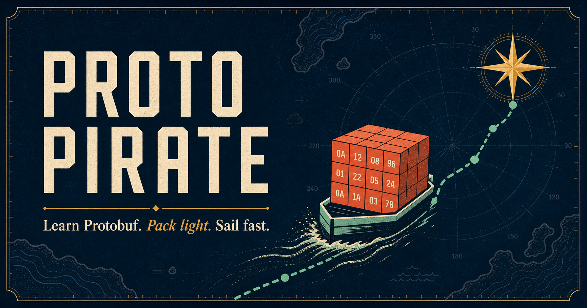
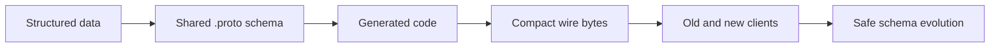

# Proto Pirate

> Learn Protobuf. Pack light. Sail fast.

[](https://proto-pirate-journey.mcgalliard.chatgpt.site/)
[](https://react.dev/)
[](https://github.com/cloudflare/vinext)



Proto Pirate is a visual, interactive introduction to Protocol Buffers. It teaches the core ideas as a five-stop voyage instead of a wall of documentation.

## Choose your stop

The links below jump directly into the hosted lesson:

| Stop | What you learn | Try it |
| --- | --- | --- |
| 01 · The problem | Why schemas can send less data than repeated JSON keys | [Compare the cargo](https://proto-pirate-journey.mcgalliard.chatgpt.site/#map) |
| 02 · The contract | How types, names, and field numbers form a `.proto` schema | [Build a schema](https://proto-pirate-journey.mcgalliard.chatgpt.site/#schema) |
| 03 · The wire | How field tags and wire types become bytes | [X-ray the bytes](https://proto-pirate-journey.mcgalliard.chatgpt.site/#wire) |
| 04 · The future | How unknown fields make gradual upgrades possible | [Evolve a message](https://proto-pirate-journey.mcgalliard.chatgpt.site/#evolve) |
| 05 · The challenge | The rules for changing schemas without breaking clients | [Take the captain's test](https://proto-pirate-journey.mcgalliard.chatgpt.site/#challenge) |

## How the lesson works

The page is a client-side React experience. Each chapter turns one Protobuf concept into a small interaction:

- The format toggle compares the same crew record as JSON and Protobuf.
- The schema builder adds and removes fields while updating the `.proto` code.
- The wire-format X-ray explains the encoded bytes field by field.
- The compatibility simulator switches between old and new clients.
- The final checkpoint gives immediate feedback on safe schema evolution.



The main experience lives in [`app/page.tsx`](app/page.tsx), the visual system is in [`app/globals.css`](app/globals.css), and the social artwork is [`public/og.png`](public/og.png).

## Run locally

You need Node.js 22.13 or newer.

```bash
git clone https://github.com/mcgalliard/protobuf-pirate.git
cd protobuf-pirate
npm install
npm run dev
```

Open [http://localhost:3000](http://localhost:3000). Changes in `app/` reload automatically.

## Test a production build

First build the app:

```bash
npm run build
```

On macOS or Linux, the normal production preview is:

```bash
npm start
```

On Windows, vinext `0.0.50` can mishandle built asset paths and chunked HTML responses. This repository includes a small local preview adapter. Run these in two terminals:

```powershell
# Terminal 1
npm run start:local

# Terminal 2
npm run preview:local
```

Then open [http://127.0.0.1:3002](http://127.0.0.1:3002). The adapter serves built assets directly and normalizes the upstream response; it is only needed for the Windows production preview, not for development or deployment.

## Verify before contributing

```bash
npm test
npm run lint
```

The test command creates a production build and checks the rendered learning journey. Contributions should preserve keyboard-accessible buttons, clear focus states, and the chapter anchors used by the README.

## Protobuf rules taught here

1. A field needs a type, a name, and a unique number.
2. Field numbers are the stable identity on the wire.
3. Add new fields with new numbers.
4. Never reuse a retired number.
5. Old readers can ignore fields they do not recognize.

Those five rules are the map. The interactive page makes them memorable.
